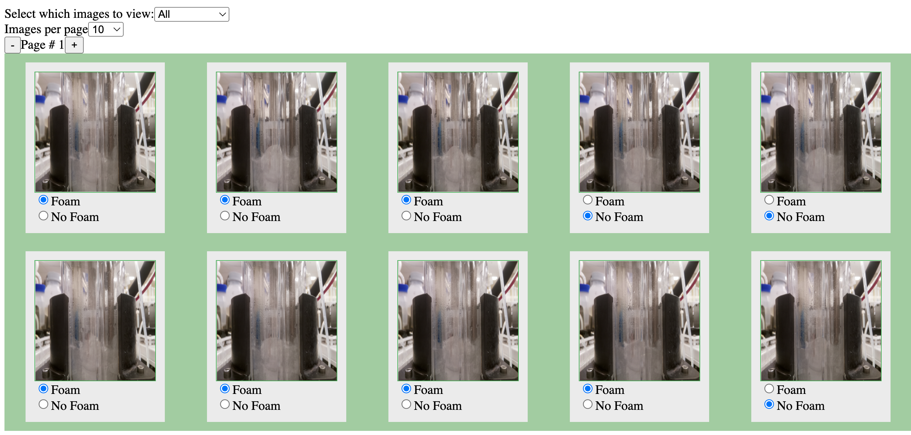

# CultureBiosciences
Take home assessment: https://culturebiosciences.notion.site/SWE-Foam-Take-Home-Challenge-94df26a0622048fc87380ca441ca85da

Video demo: https://youtu.be/xgFOwMAAsTE

Instructions:

• This program assumes you have used the json file to load data into your mongodb and used `updateMany` to add a `{status: 'unclassified'}` property to each document
• Fork and clone this repo: https://github.com/ahjohnston/CultureBiosciences
• Open the repo on your local machine
• In a terminal, run `npm install` to make sure all the packages get installed locally
• Open two other terminals and run the following scripts to start the app:
`npm start`
`npm run react-dev`
• Navigate to http://localhost:4600/
• Have fun!
